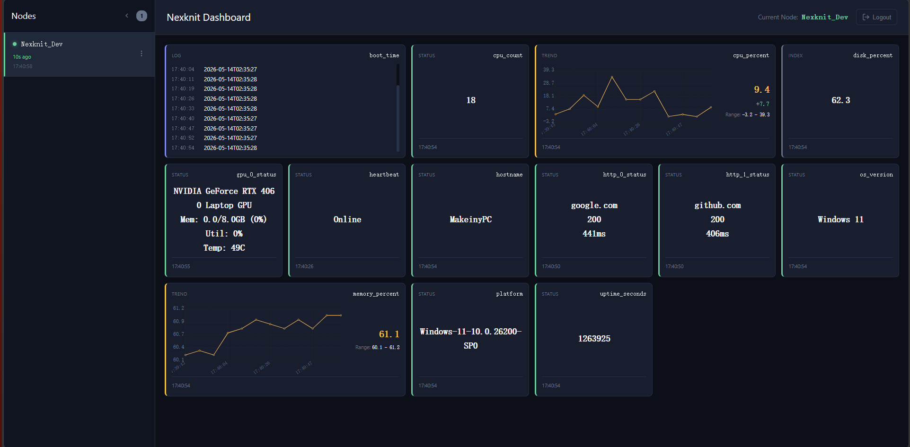

# Nexknit — Free Self-Hosted Personal Node Cluster Dashboard

> No VPS required, No Hub required, No Public IP required. 24/7 High-Availability Monitoring.
> Deploy in 3 minutes and view data in your browser immediately.
> Zero maintenance, zero dependencies, zero external attack surface.

---

**Need to view internal network metrics, status or logs from the public internet?**
**Tired of complex configurations or worried about polluting your development environment?**
**Concerned about introducing security risks, disrupting existing networks, or simply unable to open any devices?**



## **NexKnit — Born from a True Story**

During my master's degree, someone opened a port on the lab server. It was then cloud-hosted and used for remote development via VSCode.Dev. It was cool and good practice for remote development, but it did expose a public port, which eventually led to the server being hacked. This highlighted a pain point: securely monitoring the performance and status of any internet-connected device from anywhere.

This gave birth to NexKnit, a dashboard specifically designed for individuals to securely monitor any status on internet-connected nodes.

- Send text in `Name | Type | Info` format from any internet-connected node to the gateway, and view it on the dashboard.
- No security concerns - data is pushed to the cloud only via HTTPS, and responses are discarded.
- The server only needs a gateway that depends solely on Python 3.9+ and standard libraries. No dependencies, easy to audit.
- Completely free with 7x24 monitoring capability for 4 nodes. Perfect for Homelab or small-scale AI training.
- Quick integration via TCP loopback - no language restrictions. You can even send data via curl.
- Ultra-easy deployment - complete deployment in under 3 minutes with no node configuration changes.

## 🚀 Live Demo

Interested in our features? Open our Demo and see what Nexknit can do!

Enter `123456` after opening the webpage to view the dashboard! If node quota is exhausted, refer to the GIF as an alternative.

- **[AI Training Arena](https://nexknit-demo-ai-train.nexknit.workers.dev/)** — Want to monitor AI training while lying down? A simulated deep learning training task showing real-time memory usage, GPU temperature, VRAM usage, Loss curve, Epoch and training phase. **All-in-one solution for your training monitoring needs!**

    <details>
    <summary>📸 Click to view AI Training Arena Demo</summary>

    

    </details>

> Note: You can always build a new scenario, provide code and submit a PR!

## ⚡ 3-Minute Quick Deployment
> Before starting, ensure you can connect to Cloudflare. Generally, as long as you have internet access, you can connect to Cloudflare workers. In special cases, you may need to configure a proxy or VPN. The 3 minutes does not include account registration time.

**Step 1: Deploy Cloud Mailbox**

During deployment, there are two fields to fill:
- **API_KEY**: This is your API key for communication between the local gateway and cloud mailbox. Please use a strong password and do not share it with anyone. Otherwise, it may lead to data leakage and free quota consumption, resulting in service interruption.
- **Project Name**: This is your project name for accessing your dashboard in the browser. Although it has a default value, for security reasons, you should customize it to prevent direct API access after username exposure.

Click the button below to create all cloud resources in your Cloudflare account. Note that it will redirect directly to the deployment page in the current tab, and you need to manually return to this page. Also, account registration does not require credit card binding, so no need to worry.

[](https://deploy.workers.cloudflare.com/?url=https://github.com/nexknit-dev/nexknit-worker)

> Due to occasional Cloudflare outages, if one-click deployment fails or shows repository access errors, please refer to the manual deployment solution in the QA section. We apologize for this inconvenience.
> If you need to understand our exact security model, please refer to the "Architecture Design and Features" section. Additionally, the repository deployed via the button will link to our main repository and automatically build on each subsequent push. If you need to maintain a stable version, you can fork the repository and deploy from the Cloudflare Worker page, clone the repository and deploy locally, or refer to QA.8.
After deployment, you will get a URL like `https://<Project Name>.<Cloudflare Account>.workers.dev`. Note it down.

**Step 2: Start Local Gateway**

Open a terminal on the node where you need to collect data, replace `<Project Name>` and `<API_KEY>` with your own values, and enter the following command:

```bash
git clone https://github.com/nexknit-dev/nexknit-gateway
cd nexknit-gateway
python run_gateway.py --url https://<Project Name>.<Cloudflare Account>.workers.dev --api-key <API_KEY>
```

> **Tip**: If you need to specify a port, use the `--port` parameter, e.g., `python run_gateway.py --port 12345`

- This command starts a gateway and multiple example collectors, including system metrics collector, HTTP alive collector, etc. Platform differences may cause some collectors to display simulated data. For real data, install additional dependencies:
    ```bash
    pip install psutil
    ```
- The url and api-key only need to be filled in during first launch. Our gateway will automatically generate a configuration file in the same directory, and subsequent launches will automatically read it. You can also restart the gateway with these two parameters at any time, and it will automatically update the configuration file.
- Collector configurations are hardcoded in `run_gateway.py`, including alert configurations and collector list.
- If you need to customize collectors or integrate them into your project, please refer to the [Collector Development Guide](assets/COLLECTORS_GUIDE.md).

**Step 3: View Data in Browser**

Open your browser and enter `https://<Project Name>.<Cloudflare Account>.workers.dev` to view your data. If you find it useful, don't forget to check the first question in our [FAQ](#faq) section. This will help you understand our free quota design! Also, don't forget to give us a free Star! More Stars, More Devs!

- In the left node panel, colored time represents the time since last update, and the time below shows the node's last update time. If you need to delete a node, click the three dots on the right and select delete.
- In the current version of Nexknit, login relies on the fetch nodes interface. In other words, if you haven't mounted any nodes beforehand, you won't be able to login. If you encounter a situation where the left time updates but no cards show on the right, refresh or click the node lightly.
- Note that Cloudflare Workers need time to initialize during deployment, approximately one minute. However, our deployment process has been optimized sequentially, so you can usually view data immediately after deployment. If you encounter network issues, please refer to the "FAQ" section.

## FAQ

<details>
<summary>1. What is the scale of personal node clusters? How many nodes can we safely monitor within the free quota?</summary>


First, let's define a node: a node is defined as a gateway or a frontend instance. Each gateway supports collecting any number of statuses. Each frontend instance supports monitoring all collected nodes.

We can safely deploy 5 nodes within the free quota. However, if you want to know its capacity limit, it theoretically supports 133 node-hours. A node-hour is defined as one node working for one hour under theoretical conditions. But our designed working duration is 120 hours, with other quotas used as redundancy for misoperations or temporary needs. Our recommendation is to use it for 120 hours unless you really need a fifth monitoring node. You may have to bear the risk of service interruption due to exceeding the quota, but don't worry about receiving bills - we don't require credit card binding.

All of this is guaranteed by our architecture design, features and engineering test data. Please refer to the "Design Model and Test Data" section for details.

</details>

<details>
<summary>2. Cannot deploy Worker with one-click?</summary>
This issue has two main causes: occasional Cloudflare outages and your network environment. You can try switching to a more stable network or VPN. If you still cannot access the repository, you have to deploy manually. The good news is that manual deployment is not difficult. First, please confirm your Node.js version is 22.x or above. Then, execute the following commands on a node that can reach Cloudflare and GitHub. Note that this node does not necessarily need to be the node for data collection - you only need to ensure it can reach Cloudflare:

 ```bash
 git clone https://github.com/nexknit-dev/nexknit-worker
 cd nexknit-worker
 npm install
 npx wrangler deploy
 ```

You will see logs like this:

```bash
 Deployed nexknit-worker (8.08 sec)
 Deployed nex nexknit-worker triggers (1.13 sec)
 https://<Project Name>.<Cloudflare Account>.workers.dev
```

The URL is the URL of our deployed Worker. Then execute the following command and enter the API key as prompted:

```bash
  npx wrangler secret put API_KEY
```

You will see logs like this:

```bash
  
 ⛅️ wrangler 4.93.0
 ───────────────────
 √ Enter a secret value: ... *****
 🌀 Creating the secret for the Worker "nexknit-worker"
 ✨  Success! Uploaded secret API_KEY
```

Then start the Python gateway normally, enter the URL and API key, and you can directly access the URL in the browser to view the data.
</details>

<details>
<summary>3. What to do if the gateway shows the following error?</summary>

 ```bash
 <urlopen error _ssl.c:1063: The handshake operation timed out>
 SSL: handshake timed out
 ```

 We apologize, because our cloud deployment is on Cloudflare's edge nodes, and Cloudflare does not provide services within China. You may have to find a way to slightly modify your network environment to ensure your nodes can access Cloudflare's edge nodes.
 If you are sure your network environment is fine, then don't worry - just wait a moment. Our entire architecture uses stateless mode and will automatically reconnect after network recovery.
</details>

<details>
<summary>4. What to do if the frontend shows errors or bugs?</summary>
 Our frontend is completely designed according to CrashOnly principles. The only variable that spans web page lifecycles is the API key designed for automatic login. Therefore, you can use the simplest and only viable method: refresh. If this doesn't solve your problem, please submit an Issue. Considering the time difference, I will reply to you within 36 hours.

</details>

<details>
<summary>5. Want to stop using?</summary>
Our data is on CF edge nodes, so you don't need to worry about me stealing your data.
You need to log in to your Cloudflare account, open the Worker and Pages page, and delete the Worker we previously deployed, which has the same name as your project. Then, find the D1 option page and delete the database we previously deployed, which has the same name as your project. After deletion, your data will no longer be accessible.
We are very sorry for the bad experience. If you are willing to help us improve, please submit an Issue and I will reply to you within 36 hours.

</details>

<details>
<summary>6. Want to customize the collector or integrate into your own project?</summary>
We provide a complete collector development guide covering everything from getting started to advanced development:

**Quick Integration:**
- Use `run_gateway.py` to start the gateway and built-in collectors
- Collector configurations are hardcoded in `run_gateway.py`, including alert configurations

**Custom Collector Development:**
Refer to the [Collector Development Guide](assets/COLLECTORS_GUIDE.md), which includes:
- How to inherit base classes `BaseCollector` or `StorageCollector`
- How to implement the `collect()` method
- How to use the alert system to send alerts
- Complete code examples and best practices

**Protocol Format:**
```
Type|Status Name|Status Value
```
- **Type**: `I`/`Index` for index values, `T`/`Trend` for trend values, `L`/`Log` for log entries, `S`/`Status` for status text
- **Status Name**: Unique identifier, e.g., `CpuTemp`, `MemUsage`
- **Status Value**: Specific value, e.g., `65.3`, `running`

You can send data to the port monitored by the gateway using any language without any library dependencies.
  </details>

<details>
<summary>7. Want to know the detailed design of the cloud API or the source code of the frontend and cloud?</summary>
    You can view the source code of the frontend and cloud at the following URLs, and learn more detailed information from their READMEs:
    - [Frontend](https://github.com/nexknit-dev/nexknit-frontend)
    - [Cloud](https://github.com/nexknit-dev/nexknit-worker)
  </details>

<details>
<summary>8. Need to disconnect the repository from Cloudflare Worker?</summary>
    First, please open your Cloudflare account, open the Worker and Pages page, click on the Worker we previously deployed, click Settings, scroll down to find Git Repository, and finally click Disconnect.
  </details>

<details>
<summary>9. What to do if the webpage shows "Unsupported security protocol" after deployment?</summary>
  If you are a newly created account, Cloudflare may need time to initialize the domain and certificate. The official estimated time is 15 minutes to 4 hours, but in practice it is usually completed within 1-5 minutes. If the webpage shows "Unsupported security protocol" after deployment, it means your domain and certificate initialization is not yet complete. You can try incognito mode or switch devices, but usually a short wait is sufficient. This is not our design issue, but an inevitable step in domain initialization. We appreciate your understanding.
  </details>

## 🏛️ Architecture Design and Features

<details>
<summary><b>Easy to Use</b> — Zero Environment Intrusion, Easy Integration</summary>

We want nexknit to not modify the user's environment. Many monitoring solutions require installing a bunch of dependencies, configuring YAML, and starting daemons, which is too heavy for AI students who just want to check training progress.

So we set a hard constraint: the gateway only depends on Python's built-in libraries. Any machine with Python 3.9+ installed can run with `python main.py`, no `pip install` required.

More importantly: we don't let the gateway intrude into the business, but let the business intrude into the gateway. The gateway and collector communicate using a plain text TCP protocol. Anything that can write a line of text to a local port - Shell scripts, C programs, MQTT clients, Bash - is a valid collector. It doesn't need to import any libraries, doesn't need to understand the gateway's internal implementation, only needs to send a line like `I|CpuTemp|65.3`. This line of text is a complete data report.

You don't need to read SDK documentation, worry about library versions, or care about language compatibility. If your program can write a line of text to a local port, it's already a complete nexknit collector.

</details>

<details>
<summary><b>Secure</b> — Zero Inbound, Zero Attack Surface</summary>

Our security design has only one starting point: exposing public ports is unacceptable. Penetration and port forwarding are essentially opening doors in the network boundary. No matter how you harden it afterwards, the attack surface has already expanded.

So nexknit doesn't listen on any external ports. The gateway only does one thing: actively send a short HTTPS request to Cloudflare Worker, push the data up, and then immediately close the connection. The response returned by the Worker is discarded directly, and the gateway doesn't process it at all.

This forms a physical one-way valve - information can only flow from the internal network to the public network, and there is no way for the public network to establish a connection with the internal gateway. This is what we mean by "zero inbound, zero attack surface".

Regarding delayed duplex: We note that some people may want to send simple control commands to nodes from outside, such as triggering a collection or adjusting frequency. This can be done without opening inbound ports - the gateway can pull a "pending command queue" when pushing data. However, this feature involves additional security design and free quota consumption evaluation, so we haven't included it in the official development plan yet. If you have clear requirements or ideas, welcome to discuss in Issues. If the requirements are clear enough, we will consider accelerating the progress.

</details>

<details>
<summary><b>Pseudo-Smooth</b> — Jitter Buffer for Smooth Display</summary>

Public network packet loss is normal. We have tested that the random packet loss rate on cross-border links can reach more than ten percent. If we directly render the pulled data to the dashboard, the line chart will often break and the status light will flash inexplicably. This is hard to accept for someone anxiously waiting for training results.

But we can't use additional requests or long connections to ensure real-time performance - the free quota is limited. So we changed our approach: instead of displaying data immediately upon arrival, we first put it into a buffer. There is a virtual clock in the dashboard that pushes data points one by one in the order of their original timestamps. If the data for a certain time point hasn't arrived yet (because it's still floating on the public network), the clock skips it without affecting subsequent points.

The graph you see is continuous and smooth. Those late or lost points are handled behind the scenes. This is not true smoothness, but a stable view constructed on top of an unreliable transport layer. We call it "pseudo-smooth".

</details>

<details>
<summary><b>Reliable Delivery</b> — nexus Sliding Window Algorithm</summary>

This is nexknit's answer to reliability issues. The constraints we face are: zero inbound (can't use ACK), short connections (can't use TCP retransmission), and free quota (can't increase request frequency). Traditional reliability methods all fail here.

The only remaining path is application layer redundancy. Instead of "retransmitting after discovering loss", we "give more in advance, prefer duplication over omission". Each push not only carries the current batch of data, but also includes the previous two batches of old data. A data packet will be repeatedly carried in three independent push windows.

With a 5% random packet loss rate, the probability of losing all three times is 0.05³ = 0.0125%. We have verified this model with more than ten thousand real network packets. For specific stress test data and survival rates, see the "Design Model and Test Data" section.

</details>

<details>
<summary><b>Designed for Free Quota</b> — Permanently Free, No Credit Card Required</summary>

Free is the cornerstone of nexknit. We chose Cloudflare as our first choice because it currently offers the most generous free plan for individual developers - Worker request counts and D1 storage are sufficient.

But nexknit's cloud part only does transparent transmission and has no deep binding with Cloudflare. If policies change in the future or a better free service provider appears, only a very small amount of cloud code needs to be modified to migrate. There may be some degradation due to free quota differences across platforms, but it won't stop working.

We deliberately only use short connections. Not because long connections are bad, but because almost all cloud providers' free plans penalize behaviors that continuously occupy computing resources. Although short connections sacrifice the ultimate real-time performance, they bring stable and predictable zero-cost operation.

We precisely set the push and pull interval to 5 seconds, and non-real-time requests like node lists are extended to 1 minute. The packet structure has also been optimized - entries are aggregated by type and name, reducing duplicate key names and shrinking the size by 23.5%. For precise calculation results and node-hour data, see the "Design Model and Test Data" section. Free accounts do not require credit card binding.

</details>

## Mathematical Model and Test Data of nexus Algorithm

We are not just theorizing. The nexus sliding window algorithm has undergone continuous stress testing with over 12,000 data packets in real cross-border networks, running for over 17 hours.

### Stress Test Environment and Conditions

- **Test Duration**: 17.12 hours
- **Total Packets Sent**: 12,223
- **Network Environment**: Cross-border public network directly connecting to Cloudflare Workers (no VPN, no dedicated line)
- **Sliding Window**: 3 batches (T, T-1, T-2)

### Core Data

| Metric | Value | Calculation Method | Description |
| :--- | :--- | :--- | :--- |
| **HTTP Connection Failure Rate** | 15.05% | (Total Sent - First Attempt Success) ÷ Total Sent × 100% | Real loss of public network bare transmission - including random packet loss and connection interruptions due to network censorship. About 15 out of 100 pushes fail to establish HTTP connection or complete data transmission on the first attempt |
| **Final Connectivity Rate after nexus Algorithm** | 98.25% | At Least Once Arrived ÷ Total Sent × 100% | Effective data ratio users actually see after sliding window and Jitter Buffer redundancy protection |
| **Second Attempt Success Count** | 1,624 | Arrival records observed in the second push window (T-1) | Number of packets rescued by sliding window compensation mechanism in the second push - these packets failed to arrive in the first push but were saved by T-1 batch |
| **Third Attempt Success Count** | 1 | Arrival records observed in the third push window (T-2) | Very few packets rescued by T-2 batch after two consecutive failures |
| **Network Interruption Loss Count** | 214 | Sequence numbers that never arrived | This includes consecutive failures due to complete network interruption and cases where all three HTTP connections failed consecutively. This part contains both network outages and three consecutive packet losses, which are the current limitations of our algorithm |

### Metric Interpretation

**HTTP Connection Failure Rate 15.05%**: This is the real quality of the public network. Out of every 100 pushes, approximately 15 fail to successfully establish an HTTP connection or complete data transmission on the first attempt. The failure may be due to random packet loss or TLS handshake blocking caused by network censorship - our test data cannot distinguish between the two, but both appear as HTTP connection failures.

**Final Connectivity Rate after nexus Algorithm 98.25%**: This is the reliability users actually see. After three-batch sliding window redundancy protection, 98.25% of packets arrive at least once. The remaining 1.75% consists of 214 packets.

**Second Attempt Success Count 1,624**: These 1,624 packets are the core value of the nexus algorithm. They failed to arrive in the first push but were successfully delivered in the second push (T-1 batch). Without the sliding window, this data would be directly lost, and the final connectivity rate would drop from 98.25% to 84.95% - a difference of 13 percentage points.

**Third Attempt Success Count 1**: Only 1 packet was rescued by the T-2 batch after two consecutive failures. This number is very small, but it exactly illustrates two points: first, the HTTP connection failure rate is indeed around 15% (the theoretical probability of three consecutive failures is only 0.34%, and the actual measurement is even lower); second, the third layer of redundancy in the sliding window is not used in most cases, but it does exist and may have worked when you weren't looking.

**Network Interruption Loss Count 214**: This is the current shortcoming of the nexus algorithm. We don't shy away from this - these 214 packets may have encountered complete network interruption or three consecutive HTTP connection failures.

### Arrival Model

During design, we estimated that the first push success rate would be 95%, and the final failure rate after three redundancies would be approximately 0.05³ = 0.0125% (99.99% success rate). In this test, the actual first success rate was 84.95%, the theoretical failure rate was 0.1505³ = 0.034%, and the actual final success rate was 98.25%. Although there are differences between the observed and theoretical values, considering the harsh working conditions, the instability of the public network, and the actual use case (dashboard), our algorithm can still ensure seeing data most of the time. We must acknowledge the complexity of the network - after all, the public network does not promise that HTTP requests will fail uniformly 15 times out of 100.

<details>
<summary><b>Result Log</b></summary>

Nexknit Stress Test Report
Running Time: 17.12h / 36h
Remaining Time: 18.88h (47.6% completed)

Total Sent: 12223
Total Arrived: 12009
Average Arrivals per Sequence: 0.98

First Attempt Success: 10384
Second Attempt Success: 1624
Third Attempt Success: 1

Network Absolute Interruption (Never Arrived): 214
Final Effective Reception (At Least Once): 12009

Real Public Network Native Packet Loss Rate (1st Attempt Loss): 15.05%
P^3 Algorithm Final Connectivity Rate (At Least Once): 98.25%

Last 10 Sequence Lifecycle Trajectories:
Seq      Send Time     Recovery  1st Arrive  2nd Arrive  3rd Arrive
----------------------------------------------------------------------
12214     09:03:13         1         ✓         -          -
12215     09:03:18         1         ✓         -          -
12216     09:03:23         1         ✓         -          -
12217     09:03:29         1         ✓         -          -
12218     09:03:34         1         ✓         -          -
12219     09:03:39         1         ✓         -          -
12220     09:03:44         1         ✓         -          -
12221     09:03:49         1         ✓         -          -
12222     09:03:54         1         -         ✓          -
12223     09:03:59         1         ✓         -          -

Note: Unfortunately, we only saved JSON, not the log. If you need it, please contact us. We can also provide the stress test script.

</details>

---

## Offline Notifications

Worker checks for offline nodes during scheduled tasks and sends email alerts via Cloudflare Email Routing.

### Offline Notification Configuration (Optional)

To enable email notifications when nodes go offline, set up the following environment variables:

```bash
npx wrangler secret put NOTIFICATION_EMAIL  # Your email address to receive alerts
npx wrangler secret put MAIL_FROM           # Sender address (must be configured in Cloudflare Email Routing)
```

**Environment Variables**:

| Variable | Default | Description |
|----------|---------|-------------|
| `OFFLINE_THRESHOLD_MS` | `1800000` (30 minutes) | Time threshold in milliseconds before a node is considered offline |
| `NOTIFICATION_EMAIL` | (empty) | Email address to receive offline alerts (leave empty to disable) |
| `MAIL_FROM` | (empty) | Sender email address for notifications |

**Prerequisite**: You need to configure Cloudflare Email Routing to enable email sending.

### Offline Check

The Worker checks for nodes that have been offline for longer than `OFFLINE_THRESHOLD_MS`. If any offline nodes are detected and email notifications are configured, an alert email will be sent to `NOTIFICATION_EMAIL`.

---

## Quota Model and Test Data

"Free" is not a marketing slogan, but an engineering promise verified through precise calculation and real stress testing. The following is based on test data from 12 hours of stable operation with three nodes.

### Actual Quota Consumption

During 12 hours of stable operation with three nodes (one frontend, two backends):

- **Requests in Last Hour**: 1,991
- **Total Requests in 12 Hours**: 23,930
- **Average Consumption per Node per Hour**: ~665 requests
- **Daily Consumption per Node**: ~15,960 requests
- **Daily Free Quota per Account**: 100,000 requests


### Theoretical Quota Consumption
- **Theoretical Frontend Consumption per Hour**: 720 status polls + 60 node polls = 780 requests + node switching operations
- **Theoretical Backend Consumption per Hour**: 720 status pushes = 720 requests
- **Maximum Consumption under 120 Node-Hour Design Indicator** = 100000 / 120 = 833 requests
- **Frontend Redundancy** = 833 requests - 780 requests = 53 requests
- **Backend Redundancy** = 833 requests - 720 requests = 113 requests

Calculations show that each frontend theoretically consumes 780 requests + node switching operations, while each backend consumes 720 requests. The 168 redundant requests are sufficient to cover node switching operations three times per minute. Considering the request failure rate, our redundancy becomes even more reliable.

### Capacity Assessment

A free account is sufficient to support the theoretically designed 120 node-hours with approximately 10% redundancy. This margin is enough to cover temporary traffic fluctuations, misoperations, node switching operations, and additional node polling - and can even occasionally support extra viewing needs, although there is a potential risk of exceeding the quota.

### Real Data Screenshot

The following is a real traffic screenshot from Cloudflare Dashboard. This is desensitized raw data, and all calculations are based on it:


## 📜 License and Contribution

Welcome to contribute via Issues and PRs.

**Highly appreciated contribution areas**:
- Frontend beautification (dashboard UI, responsive layout)
- Collector development (CPU, GPU, Docker, systemd, etc.)
- Splash screen corpus expansion (https://github.com/nexknit-dev/nexknit-frontend/blob/main/src/data/corpus.ts, you can sign your name and add soft ads)