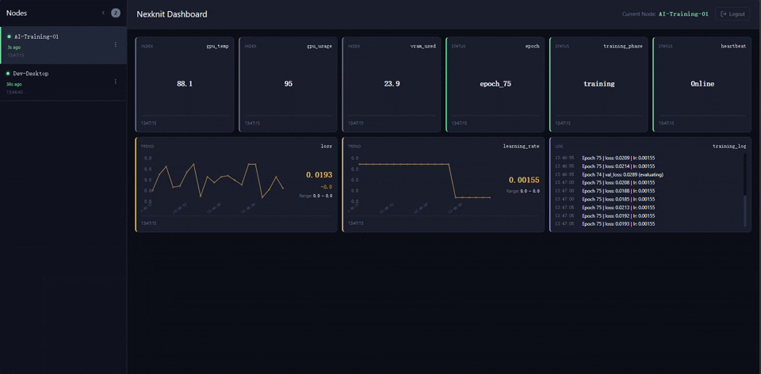
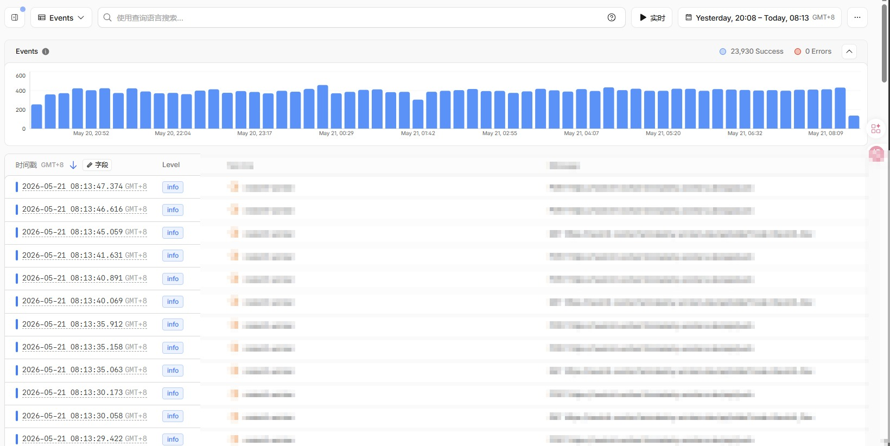

📖 [中文](README_CN.md) | English
---

# Nexknit —— Free Self-Hosted Personal Node Cluster Dashboard

> No VPS. No Hub. No public IP. High-availability monitoring, all day, every day.
> Three minutes to deploy. Instantly view your data in the browser.
> Zero ops. Zero dependencies. Zero external attack surface.

---

**Need to check values, status, or logs on your nodes from the public internet?**
**Find setup a hassle, or worried about polluting your dev environment?**
**Afraid of introducing security risks, breaking your network, or simply can't open any devices?**



## **NexKnit —— An Answer That Starts with a True Story**

During my master's, someone opened a port on a lab server. Makes sense, right? It was forwarded through a cloud VPS and used for remote dev via VSCode.Dev. Pretty cool, and solid remote development practice. But then the port got sniffed. Every server connected to the intranet was turned into a mining rig. The Docker-equipped servers were fine—just shut down the containers. But we had one six-GPU machine that was completely unguarded. It had to be wiped. We lost access to it for almost an entire semester.

You might ask: why didn't we set up proper protection? There are many answers to that question, but none of them fix anything. A server in the real world always runs the risk of being breached. No amount of hardening can stop a zero-day exploit.

But that incident gave birth to our NexKnit—a dashboard built specifically for safely monitoring any status on your personal nodes.

- Send text in `Name | Type | Info` format from any internet-connected node to the gateway, and view it on the dashboard.
- No security concerns: data is pushed via HTTPS only, and responses are immediately discarded.
- Deploy a gateway that only depends on Python 3.9+ and standard libraries. Zero dependencies, easy to audit.
- Completely free: 7*24 monitoring for up to four nodes, perfect for homelabs or small-scale AI training.
- Quick integration: TCP listener, no language restrictions—you can even send data via curl.
- Easy deployment: complete setup in three minutes, no node configuration changes required.

## 🚀 Try It Live

Curious about what it can do? Open our Demo and see Nexknit in action!

Just enter `123456` on the webpage and the dashboard appears! If the node quota is exhausted, a corresponding GIF is a less ideal alternative.

- **[AI Training Field](https://nexknit-demo-ai-train.nexknit.workers.dev/)** — Ever wanted to monitor AI training while lying down? A simulated deep learning task, showing memory usage, GPU temperature, VRAM usage, Loss curve, Epoch, and training phase in real time. **One-stop coverage for all your training monitoring needs!**

    <details>
    <summary>📸 Click to view AI Training Field demo</summary>

    

    </details>

> Note: You can always build a new scenario, provide code, and submit a PR to us!

## ⚡ Three-Minute Quick Deploy
> Before you start, make sure you can connect to Cloudflare. Generally, as long as you have internet, you can reach a Cloudflare Worker. In special cases, you might need a proxy or VPN. The three minutes doesn't include Cloudflare account registration time.

**Step One: Deploy the Cloud Mailbox**

During deployment, you'll need to fill in two fields:
- **API_KEY**: Your API secret, used for communication between the local gateway and the cloud mailbox. Use a strong password and don't share it. Leaking it could lead to data breaches and free quota exhaustion, which would take your service offline.
- **Project name**: Your project name, used to access the dashboard in a browser. It has a default value, but for security you should customize it. This prevents anyone who knows your username from directly accessing the API.

Click the button below. It will create all cloud resources inside your Cloudflare account.

[](https://deploy.workers.cloudflare.com/?url=https://github.com/nexknit-dev/nexknit-worker)

> Due to occasional Cloudflare glitches, if the one-click deploy fails or says the repo is unreachable, scroll down to the FAQ section for a manual deployment guide. We sincerely apologize for this.
> If you need to know our exact security model, scroll down to the "Architecture Design & Characteristics" section. Additionally, the repository deployed via the button will be linked to our main repository and automatically built on subsequent pushes. If you need to maintain a stable version, you can fork the repository and deploy from the Cloudflare Worker page, clone the repository and deploy locally, or refer to FAQ.8.
Once deployed, you'll get a URL like `https://<Project name>.<Cloudflare Account>.workers.dev`. Keep it handy.

**Step Two: Launch the Local Gateway**

Open a terminal on the node you want to collect data from. Replace `<Project name>` and `<APIKey>` with your own values, then run:

```bash
git clone https://github.com/nexknit-dev/nexknit-gateway
cd nexknit-gateway
python main_with_exmp.py --url https://<Project name>.<Cloudflare Account>.workers.dev --api-key <APIKey>
```

-  This command starts a gateway and a sample collector that gathers data including CPU temperature and sends it to the cloud. Note that platform differences might cause real data collection to fail, in which case it falls back to simulated data. If you need actual data, you might need to install an extra library.
    ```python
    pip install psutil
    ```
- You only need to provide the url and api-key the first time. Afterwards, the gateway automatically generates a config file in the same directory and reads from it on subsequent starts. You can always restart the gateway with these two parameters to update the config. You can also modify other parameters, like the node name, directly in the config file to change the gateway's behavior.
- If you want to customize the collector or integrate our collector into your project, please check QA.6. Trust me, our integration is dead simple.

**Step Three: View Data in Your Browser**

Open your browser and go to `https://<Project name>.<Cloudflare Account>.workers.dev` to see your data. If you find it useful, don't forget to check out the first question in our [FAQ](#faq). It'll help you understand our free-tier design! Oh, and don't forget to hit that free Star! More Star, More Dev!

- In the left node panel, colored time indicates the time since last update, and the time below shows the node's last update time. To delete a node, click the three dots on the right and select Delete.
- In the current version of Nexknit, login depends on the fetch nodes API. In other words, if you haven't mounted any nodes beforehand, you won't be able to log in. If you see the time updating on the left but no cards showing on the right, refresh or click the node.
- Note: Cloudflare Workers need roughly one minute to initialize upon deployment. But our deployment flow is sequenced to optimize for this. Generally, you can view your data right after deployment. If you run into network issues, refer to the "FAQ" section.

## FAQ

<details>
<summary>1. How big exactly is a personal node cluster? How many nodes can we safely monitor within the free tier?</summary>

First, let's define a node: a node is defined as either one gateway or one frontend instance. Each gateway can collect any number of statuses. Each frontend instance can monitor all collected nodes.

We can safely deploy 5 nodes within the free tier. If you want to know the absolute boundary, it can theoretically support 133 node-hours, where a node-hour is defined as one node working for one hour under theoretical conditions. However, our design working time is 120 hours, with the remaining quota serving as buffer for misoperations or temporary needs. We recommend sticking to 120 hours, unless you really need that fifth monitoring node. You might have to accept the risk of service downtime from exceeding the quota, but don't worry about receiving a bill—we haven't even linked a credit card.

All of this is guaranteed by our architecture design, characteristics, and measured engineering data. See the "Design Models & Measured Data" section for details.

</details>

<details>
<summary>2. Can't deploy the Worker with one click?</summary>
Sorry, this is an occasional Cloudflare issue, so you'll have to deploy manually. The good news is, manual deployment isn't difficult. First, ensure your Node.js version is 22.x or above, then on a node that can reach Cloudflare and GitHub, run:

 ```bash
 git clone https://github.com/nexknit-dev/nexknit-worker
 cd nexknit-worker
 npm install
 npx wrangler deploy
 ```

You'll see logs like:

```bash
 Deployed nexknit-worker (8.08 sec)
 Deployed nex nexknit-worker triggers (1.13 sec)
 https://<Project name>.<Cloudflare Account>.workers.dev
```

That URL is the address of the deployed Worker. Then run the following and enter the API_KEY when prompted:

```bash
  npx wrangler secret put API_KEY
```

You'll see logs like:

```bash 
 ⛅️ wrangler 4.93.0
 ───────────────────
 √ Enter a secret value: ... *****
 🌀 Creating the secret for the Worker "nexknit-worker"
 ✨  Success! Uploaded secret API_KEY
```

Then start the Python gateway normally, provide the URL and API_KEY, and you can access the data directly in your browser.
</details>

<details>
<summary>3. What if the gateway shows an error like this?</summary>

 ```bash
 <urlopen error _ssl.c:1063: The handshake operation timed out>
 SSL: handshake timed out
 ```

Sorry, because our cloud is deployed on Cloudflare's edge nodes and Cloudflare does not provide services inside China, you may need to slightly adjust your network environment to ensure your node can reach Cloudflare's edge nodes.
If you're sure your network is fine, then no need to panic—just wait a moment. Our entire architecture uses a stateless model and will automatically reconnect once the network recovers.
</details>

<details>
<summary>4. What if the frontend has an error or bug?</summary>
Our frontend is fully CrashOnly by design. The only cross-page-lifetime variable is the API_KEY used for automatic login. So you can use the simplest—and only—solution: refresh the page. If that doesn't fix it, please file an Issue. Accounting for timezone differences, I'll reply within 36 hours.
</details>

<details>
<summary>5. Want to stop using it?</summary>
Our data is all on CF edge nodes. You don't need to worry about me stealing your data.
You need to log into your Cloudflare account, go to the Worker and Pages page, and delete the Worker we deployed earlier—it has the same name as your Project name. Then, find the D1 options page and delete the database we deployed earlier—also named the same as your Project name. Once deleted, your data can no longer be accessed.
If this was our fault, we're very sorry for the bad experience. If you're willing to help us improve, please file an Issue. I'll reply within 36 hours.
</details>

<details>
<summary>6. Want to customize the collector or integrate it into your own project?</summary>
Please refer to our `collector_template.py` file. The comments inside will help you understand how to customize the collector. Note that our protocol is very simple; you can feed it directly to an LLM along with your requirements. In tests, LLMs generate a protocol-compliant collector based on your needs.

If you want to integrate it into your project, such as an AI experiment, please refer to the `one_shot_template.py` file. The comments inside will help you understand how to integrate our collector. Note that our protocol format is:

- `Type|MetricName|MetricValue`
- Type: `I` / `Index` for index values (e.g., disk usage), `T` / `Trend` for trend values (e.g., CPU, temperature), `L` / `Log` for log entries, `S` / `Status` for status text (e.g., hostname, phase).
- MetricName: A unique identifier for the metric, such as `CpuTemp`, `MemUsage`, etc.
- MetricValue: The specific value of the metric, such as `65.3`, `0.5`, etc.

You don't need to worry about spaces; just send data in this format to the port the gateway listens on, and it will automatically collect and organize it. This means you can send data from anywhere using any language.
  </details>

<details>
<summary>7. Want to know the detailed API design of the cloud or the source code of the frontend and cloud?</summary>
You can view the source code of the frontend and cloud at the following URLs, and learn more details from their READMEs:
- [Frontend](https://github.com/nexknit-dev/nexknit-frontend)
- [Cloud](https://github.com/nexknit-dev/nexknit-worker)
  </details>

<details>
<summary>8. Need to disconnect the repository from Cloudflare Worker?</summary>
First, open your Cloudflare account, navigate to the Workers and Pages page, click on the Worker we deployed earlier, go to Settings, scroll down to Git repository, and click Disconnect.
  </details>

<details>
<summary>9. Getting "Unsupported security protocol" error after deployment?</summary>
If you have a newly created account, Cloudflare may need time to initialize the domain and certificate. The official estimate is 15 minutes to 4 hours, but in practice it usually completes within 1-5 minutes. If you see "Unsupported security protocol" after deployment, it means the domain and certificate initialization is still in progress. You can try incognito mode or another device, but usually just a short wait is sufficient. This is not a design issue, but an inevitable step in domain initialization. Thank you for your understanding.
  </details>

## 🏛️ Architecture Design & Characteristics

<details>
<summary><b>Ease of Use</b> — Zero environment intrusion, dead simple to integrate</summary>

We want nexknit to leave your environment untouched. Many monitoring solutions require installing a pile of dependencies, configuring YAML, and starting daemon processes—way too heavy for an AI student who just wants to glance at training progress.

So we set a hard constraint: the gateway depends solely on Python's built-in libraries. On any machine with Python 3.9+, `python main.py` just runs. No `pip install`.

More importantly, we don't let the gateway intrude into your business; we let your business intrude into the gateway. The gateway and collector communicate over a plain-text TCP protocol. Anything that can write a line of text to a local port—Shell scripts, C programs, MQTT clients, Bash—is a valid collector. It doesn't need to import any libraries, doesn't need to understand the gateway's internals, just needs to send a line like `I|CpuTemp|65.3`. That single line is a complete data report.

You don't need to read SDK docs, manage library versions, or worry about language compatibility. If your program can write a line of text to a local port, it's already a fully functional nexknit collector.

</details>

<details>
<summary><b>Security</b> — Zero inbound, zero attack surface</summary>

Our security design starts from a single premise: exposing a public port is unacceptable. Tunneling and port forwarding, at their core, are about opening a door at the network boundary. No matter how you harden it afterwards, the attack surface has already expanded.

So nexknit does not listen on any external ports. The gateway does one thing: it actively initiates a brief HTTPS connection to a Cloudflare Worker, pushes the data up, and immediately closes the connection. The Worker's response is discarded; the gateway does nothing with it.

This creates a physical-grade one-way valve—information can only flow from the intranet to the public internet, and the public internet has zero means of establishing a connection back to the intranet gateway. This is the physical basis of "zero inbound, zero attack surface."

Regarding delayed duplex: we've noticed some people might want to send simple control commands from outside to a node—like triggering a collection or adjusting the frequency. This is feasible without opening inbound ports—the gateway could pull a "pending command queue" alongside each push. But this feature involves extra security design and free quota consumption evaluation, so we haven't put it into the formal development plan yet. If you have a clear need or ideas, feel free to discuss in an Issue. If demand is clear enough, we'll consider accelerating it.

</details>

<details>
<summary><b>Pseudo-Fluidity</b> — Jitter Buffer for smooth display</summary>

Packet loss is the norm on the public internet. We've measured it ourselves—random loss rates on cross-border links can reach over a dozen percent. If data were rendered directly onto the dashboard, line charts would constantly break, and status lights would flicker erratically. That's hard to accept for someone anxiously waiting for training results.

But we can't guarantee real-timeness by adding more requests or keeping long connections—the free quota is right there. So we took a different approach: data isn't displayed the moment it arrives. It goes into a buffer first. The dashboard has a virtual clock that releases data points one by one according to their original timestamps. If a point for a particular moment hasn't arrived yet (because it's still drifting across the public internet), the clock simply skips it, leaving the following points unaffected.

What you see is a continuous, smooth chart. Those late or lost points are handled behind the scenes. This isn't true fluency—it's a stable view constructed on top of an unreliable transport layer. We call it "pseudo-fluidity."

</details>

<details>
<summary><b>Reliable Arrival</b> — nexus sliding window algorithm</summary>

This is nexknit's answer to the reliability question. The constraints we face are: zero inbound (no ACKs allowed), short connections (no TCP retransmission), free quota (no extra requests). Traditional reliability mechanisms all fail here.

The only remaining path is application-layer redundancy. We don't "discover a loss and resend." We "give more up front—better to repeat than to miss." Every push carries not only the current batch's data but also the two previous batches. A single data point is carried repeatedly across three independent push windows.

At a 5% random packet loss rate, the probability of all three pushes failing is 0.05³ = 0.0125%. We've validated this model with over ten thousand real network packets. See the "Design Models & Measured Data" section for detailed stress-test data and survival rates.

</details>

<details>
<summary><b>Free-Tier-Oriented Design</b> — Free forever, no credit card needed</summary>

Free is the cornerstone of nexknit. We chose Cloudflare as our primary provider largely because it currently offers the most generous free plan for individual developers—enough Worker requests and D1 storage to go around.

But nexknit's architecture is not deeply tied to Cloudflare. The cloud part is an extremely thin, transparent "mailbox" layer. If Cloudflare's policies change, or a better free provider emerges, we can migrate nexknit to another platform (like AWS Lambda or Azure Functions) with minimal changes to the cloud-side code. The only caveat is that differences in free quotas across providers might cause some service degradation, but it won't stop working.

We deliberately use only short-lived connections. Not because long connections are bad, but because nearly every cloud provider's free plan penalizes sustained consumption of compute resources. Short connections sacrifice the absolute best real-timeness in exchange for stable, predictable zero-cost operation.

We precisely set the push and pull interval to 5 seconds, and lengthen non-real-time requests like the node list to 1 minute. We also optimized the packet structure—aggregating entries by type and name and reducing repeated key names shrank packet size by 23.5%. See the "Design Models & Measured Data" section for precise calculations and node-hour data. A free account doesn't need a credit card.

</details>

## Mathematical Model & Measured Data of the nexus Algorithm

We don't deal in armchair theory. The nexus sliding window algorithm has undergone continuous stress testing with over 12,000 data packets on real cross-border networks, running for over 17 hours.

### Stress Test Environment & Conditions

- **Test duration**: 17.12 hours
- **Total packets sent**: 12,223
- **Node configuration**: Three nodes (one frontend, two backends), stable for 12 hours
- **Network environment**: Cross-border public internet, direct to Cloudflare Workers (no VPN, no dedicated line)
- **Sliding window**: 3 batches (T, T-1, T-2)

### Core Data

| Metric | Value | Calculation | What it tells us |
| :--- | :--- | :--- | :--- |
| **HTTP Connection Failure Rate** | 15.05% | (Total sent - First-batch arrivals) ÷ Total sent × 100% | Real loss over bare public internet—covers both random packet loss and connection drops due to network censorship. About 15 out of every 100 pushes fail to establish an HTTP connection or complete data transfer on the first attempt |
| **Final Connectivity Rate after nexus Algorithm** | 98.25% | At-least-once arrivals ÷ Total sent × 100% | The effective data ratio users actually see, after sliding window and Jitter Buffer redundancy |
| **Second-attempt arrivals** | 1,624 | Arrival records observed during the second push window (T-1) | The number of packets salvaged by the sliding window compensation mechanism on the second push—these failed on the first push but were rescued by the T-1 batch |
| **Third-attempt arrivals** | 1 | Arrival records observed during the third push window (T-2) | The extremely rare packets rescued by the T-2 batch after two consecutive failures |
| **Network Interruption Losses** | 214 | Sequence numbers that never arrived | This includes consecutive failures from complete network outages, as well as three consecutive HTTP connection failures. This portion contains both network blackouts and triple packet loss, which together represent the current limits of our algorithm |

### Metric Interpretation

**HTTP Connection Failure Rate 15.05%**: This is the quality of the real public internet. Out of every 100 pushes, roughly 15 fail on the first attempt to establish an HTTP connection or complete data transfer. The cause could be random packet loss, or it could be TLS handshake blocking from network censorship—our stress test data can't distinguish the two, but both manifest as HTTP connection failures.

**Final Connectivity Rate after nexus Algorithm 98.25%**: This is the reliability users actually see. After three-batch sliding window protection, 98.25% of data packets arrived at least once. The remaining 1.75% are 214 packets.

**Second-attempt arrivals 1,624**: These 1,624 packets are the core value of the nexus algorithm. They failed on the first push but were successfully delivered on the second push (T-1 batch). Without the sliding window, this data would simply be lost, and the final connectivity rate would drop from 98.25% to 84.95%—a 13-percentage-point difference.

**Third-attempt arrivals 1**: Only one packet was rescued by the T-2 batch after two consecutive failures. This tiny number illustrates two things: first, that the HTTP connection failure rate is indeed around 15% (the theoretical probability of three consecutive failures is only 0.34%, and the measured rate is even lower); second, that the third layer of sliding window redundancy is almost never needed, but it exists, and it may have already worked without you knowing.

**Network Interruption Losses 214**: This is the current weak spot of the nexus algorithm. We don't shy away from it—these 214 packets may have encountered complete network outages, or they may have encountered three consecutive HTTP connection failures.

### Arrival Model

When designing, we estimated a first-push success rate of 95%, with the final failure rate after triple redundancy at roughly 0.05³ = 0.0125% → 99.99%. In this stress test, the actual first-push success rate was 84.95%, with a theoretical failure rate of 0.1505³ = 0.034%, and an actual final success rate of 98.25%. Although there is a gap between observed and theoretical values, considering the harsh conditions, the instability of the public internet, and the actual use case—a dashboard—our algorithm still ensures data is visible most of the time. We must acknowledge the complexity of the network; after all, the public internet makes no promise to evenly fail 15 out of every 100 HTTP requests.

<details>
<summary><b>Result Log</b></summary>

Nexknit Stress Test Report
Duration: 17.12h / 36h
Remaining: 18.88h (47.6% completed)

Total Sent: 12223
Total Arrived: 12009
Average Arrivals per Sequence: 0.98 times

First-attempt arrivals: 10384
Second-attempt arrivals: 1624
Third-attempt arrivals: 1

Network Interruption Losses (never arrived): 214
Final Effective Receipts (at least once): 12009

Real Public Internet Native Packet Loss Rate (1st Attempt Loss): 15.05%
Final Connectivity Rate after P^3 Algorithm (At Least Once): 98.25%

Lifecycle trace of the last 10 sequences:
Seq    Sent Time    Heal Count   1st Arr   2nd Arr   3rd Arr
----------------------------------------------------------------------
12214  09:03:13         1           ✓         -         -
12215  09:03:18         1           ✓         -         -
12216  09:03:23         1           ✓         -         -
12217  09:03:29         1           ✓         -         -
12218  09:03:34         1           ✓         -         -
12219  09:03:39         1           ✓         -         -
12220  09:03:44         1           ✓         -         -
12221  09:03:49         1           ✓         -         -
12222  09:03:54         1           -         ✓         -
12223  09:03:59         1           ✓         -         -

Note: Unfortunately, we only saved the JSON, not the full log. If you need it, please contact us. We can also provide the stress test script.

</details>

---

## Quota Model & Measured Data

"Free" is not a marketing slogan; it's an engineering promise backed by precise calculation and real stress test verification. Below is measured data from 12 hours of stable three-node operation.

### Real Quota Consumption

Over 12 hours of stable three-node (one frontend, two backend) operation:

- **Last-hour requests**: 1,991
- **12-hour total requests**: 23,930
- **Average per-node hourly consumption**: ~665 requests
- **Per-node daily consumption**: ~15,960 requests
- **Daily free quota per account**: 100,000 requests

### Theoretical Quota Consumption
- **Theoretical frontend consumption per node-hour**: 720 status polls + 60 node list polls = 780 requests + node-switching operations
- **Theoretical backend consumption per node-hour**: 720 status pushes = 720 requests
- **Max consumption under 120 node-hour design target** = 100000 / 120 = 833 requests
- **Frontend redundancy** = 833 requests - 780 requests = 53 requests
- **Backend redundancy** = 833 requests - 720 requests = 113 requests

The calculation shows each frontend theoretically consumes 780 requests + node-switching operations, and each backend theoretically consumes 720 requests. The 168 redundant requests are more than enough to cover three node switches per minute. Accounting for request failure rates, our redundancy becomes even more reliable.

### Capacity Assessment

A single free account is sufficient to support the 120 node-hours from the theoretical design, with roughly 10% redundancy. This buffer is enough to cover temporary traffic fluctuations, misoperations, node-switching operations, and extra node polling—and can even occasionally support extra viewing needs, though with a slight risk of exceeding the quota.

### Real Data Screenshot

Below is a real traffic screenshot from the Cloudflare Dashboard. This is the desensitized raw data; all calculations are based on this:



## 📜 Open Source License & Contributing

Contributions are welcome through Issues and PRs.

**Areas we especially welcome**:
- Frontend beautification (dashboard UI, responsive layout)
- Collector development (CPU, GPU, Docker, systemd, etc.)
- Opening-line corpus expansion (https://github.com/nexknit-dev/nexknit-frontend/blob/main/src/data/corpus.ts — attribution and soft ads welcome!)